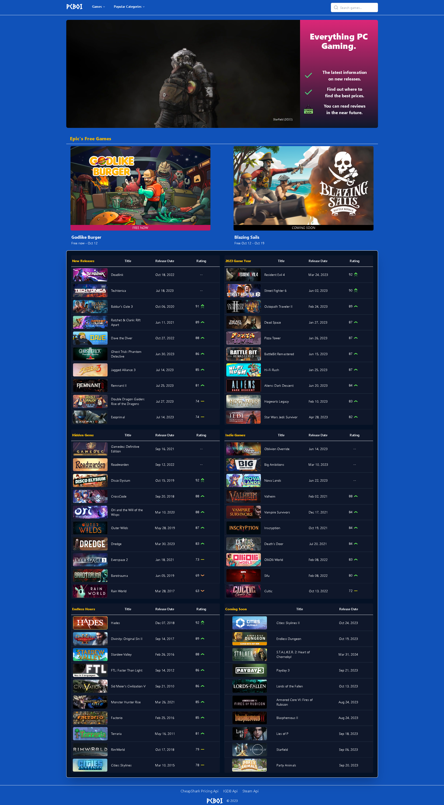

<h1>PCBOI - Game Information/Review Website</h1>

## Table of Contents

- [Table of Contents](#table-of-contents)
- [Overview](#overview)
- [Built With](#built-with)
- [Purpose](#purpose)
- [Contact](#contact)

## Overview

Link to website - [PCBOI](https://pcboi.vercel.app/)

PCBOI is a website that provides information and reviews on PC games. The project turned out to be more complex than I was anticipating. At first, I was hoping that there would be an API that had all the right information on PC games. I quickly realized that most of the "public" game APIs were either unfinished or had a lot of limitations on using the API (rate limiting). I ended up using 3 different APIs (Steam, IGDB, and CheapShark) and also using Puppeteer to web scrape certain public data and store it in MongoDB. In the future, I want to web scrape all my data and just store it in my backend to make things easier. I have added over 26 thousand games to date, with more coming in the near future.

In addition, I want to add a login system that gives users the ability to review certain games. I am still in the process of designing a review layout form. I also want to publish my own reviews of games, but with a limited amount of time, I have decided to focus on the information gathering first.

Lastly, the project gave me a better understanding of Next.js' server-side rendering. I was able to do all of my fetching on the server. I still have areas where I can improve the performance of the site. Also, have a better understanding of using Prisma with MongoDB.

## Built With

- [Next.js](https://nextjs.org/)
- [Tailwind](https://tailwindcss.com/)
- [Hosted on Vercel](https://vercel.com/)
- [Shadcn UI](https://ui.shadcn.com/)
- [MongoDB](https://www.mongodb.com/)
- [Prisma](https://www.prisma.io/)
- [Steam API](https://steamcommunity.com/dev)
- [IGDB API](https://www.igdb.com/api)
- [CheapShark API](https://apidocs.cheapshark.com/)
- [Puppeteer](https://pptr.dev/)

## Purpose

I have a passion for games and wanted to make a website that users could find tons of information on their favorite PC games.

## Contact

- [Github](https://github.com/MCervone14)
- [My Portfolio](https://mcervone14.github.io/portfolio/)
